# civil-service

Civil CCD Callback Service.

### Contents:

- [StateFlow diagrams](#stateflow-diagrams)
- [Building and deploying application](#building-and-deploying-the-application)
- [Pact or contract testing](#pact-or-contract-testing)
- [Adding Git Conventions](#adding-git-conventions)

## StateFlow diagrams

Visual snapshots of the automated journey logic are generated from the live StateFlow configuration. The diagrams below update automatically via the `Refresh StateFlow diagrams` GitHub Action after any change to the transition builders.

#### Draft to Submission


#### Claim Issue & Notification


#### Awaiting Defence & Divergence


#### Post-Response Outcomes & Settlement


Each image links to an SVG whose source (`docs/*.mmd`) is produced by `python3 scripts/export_stateflow_transitions.py`. If you need the narrative in text form, see `docs/stateflow_transition_catalogue.md` or the structured `docs/stateflow/transition_catalogue.json`.

- Per-state allowed CCD events: [flowstate_allowed_events.md](docs/flowstate_allowed_events.md)
- Spec-only allowed CCD events: [flowstate_allowed_spec_events.md](docs/flowstate_allowed_spec_events.md)

## Building and deploying the application

### Building the application

The project uses [Gradle](https://gradle.org) as a build tool. It already contains
`./gradlew` wrapper script, so there's no need to install gradle.

To build the project execute the following command:

```bash
  ./gradlew build
```

### Preview environment

Preview environment will be created when opening new PR. CCD and Camunda BPMN definitions will be pulled from the latest
GitHub releases.

To access XUI visit url (make sure that it starts with `https`, otherwise IDAM won't let you log in):

- `https://xui-civil-service-pr-PR_NUMBER.service.core-compute-preview.internal`

To access Camunda visit url (login and password are both `admin`):

- `https://camunda-civil-service-pr-PR_NUMBER.service.core-compute-preview.internal`


### Functional test labels for targeted testing
There are a variety of labels that can be added to PRs for the purpose of running sub-groups of functional tests, relevant to specific journeys. All functional test labels begin with the pr_ft_ prefix.

Adding a functional test label allows the user to run a greater amount of tests relevant to the journey where changes are being made, and reduces the amount of time taken to run a build.

For example, if the label pr_ft_spec-part-admit is added to a PR, the PR will run only the API tests relevant to the Spec Part Admit journey.

It is also possible to add two labels to a PR to target multiple journeys. For example, if the labels pr_ft_spec-part-admit, and pr_ft_spec-part-admit are added to a PR, the PR will run only the API tests relevant to the Spec Part Admit, and Spec Full Admit journeys.

If no functional test label has been added to a PR, the full set of regression tests (api-nonprod) will be run.

For more details about the functional test labels available, the tests that run under each label, and the guidelines for using them, please refer to this confluence page: https://tools.hmcts.net/confluence/display/ROC/GitHub+Labels+for+Testing


## Contract testing

### Generate contracts

You can generate contracts as follows:

```
./gradlew contract
```

### Publish contracts

If you want to publish the contracts to hmcts pact broker, please set this env variable accordingly before running the
publish command.

```
export PACT_BROKER_FULL_URL=http://pact-broker.platform.hmcts.net/
```

If you want to publish the RPA contract to the PactFlow pact broker, please set this env variable accordingly before
running the publish command. By setting your env variable to this, the IDAM contract will be ignored and only the RPA
contract will be published to PactFlow.

```
export PACT_BROKER_FULL_URL=https://civil-claims.pactflow.io/
```

Before running, you should set the API token to connect to the pactflow portal as follows:

```bash
export PACT_BROKER_TOKEN=<api token here>
```

The API Token can be obtained on [Confluence](https://tools.hmcts.net/confluence/display/CU/Pactflow).

To publish your contracts:

```
./gradlew pactPublish
```

* If connecting to Pactflow, please disable the HMCTS VPN.

## Gradle Dependency Check - Running Locally
In the local environment, as of 15/12/2023 where dependency check is mandated to use version 9 or above:
https://github.com/jeremylong/DependencyCheck?tab=readme-ov-file#900-upgrade-notice

Users will now need to generate a NVD API key for themselves in order to run some gradle dependency commands:
https://nvd.nist.gov/developers/request-an-api-key

Example
```
./gradlew -DdependencyCheck.failBuild=true -Dnvd.api.check.validforhours=24 -Dnvd.api.key=<YOUR_API_KEY_HERE> dependencyCheckAggregate
```

## Development / Debugging Environment - Preview with Mirrord

  As an alternative for a development environment there is a procedure in place where after running the command
below the required services for Civil are created in Preview under the developer's name, so these will be exclusively
for the named developer use.

While connected to the VPN simply run one of the below commands from your project's (civil-service) folder:
Note: be sure to have Docker running
```shell
npx @hmcts/dev-env@latest && ./bin/setup-devuser-preview-env.sh
```
You can optionally specify a branch for CCD definitions and Camunda definitions like below or leave it blank to use master.

```shell
npx @hmcts/dev-env@latest && ./bin/setup-devuser-preview-env.sh ccdBranchName camundaBranchName
```
If you want to clean up the environment just run:

```shell
npx @hmcts/dev-env@latest --delete
```

Once the pods are up and running you can connect to them using a plugin called Mirrord on Intellij.
https://mirrord.dev

Most times, by just enabling the Mirrord plugin and running the application in debug mode a popup will come for you to select the target pod running civil-service.
In some setups you will need a mirrord config file specifying the pod as below.

The script should create a /.mirrord/.mirrord.json config file under the project's root directory.

Specifically for civil-service you might need to exclude a flyway environment variable to allow the startup process to run without errors.
For that you should have such file as this:

```json
{
  "feature": {
    "network": {
      "incoming": "steal",
      "outgoing": true
    },
    "fs": "read",
    "env": {
      "override": {
        "REFERENCE_DATABASE_MIGRATION": "false"
      }
    }
  },
  "target": {
    "path": {
      "pod": "Your civil-service pod ID"
    },
    "namespace": "civil"
  },
  "operator": false,
  "agent": {
    "flush_connections": false,
    "startup_timeout": 300,
    "namespace": "civil"
  }
}
```
## Point CCD definitions to a specific branch

Add the following label to your GitHub PR.

```
civilDefinitionBranch:????

where ???? is the branch name you want to point to. e.g civilDefinitionBranch:DTSCCI-1699
```


## License

This project is licensed under the MIT License - see the [LICENSE](LICENSE) file for details
