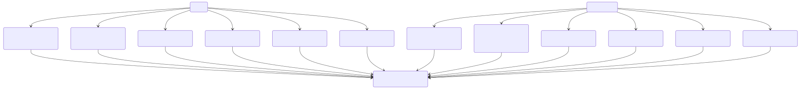
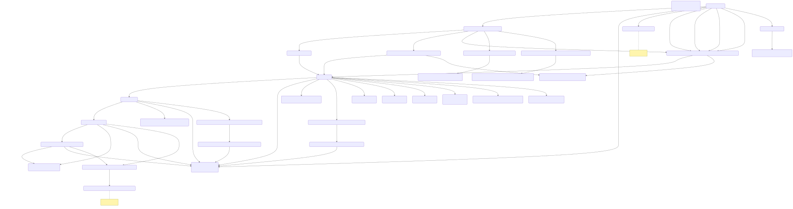
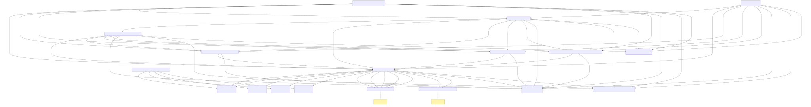
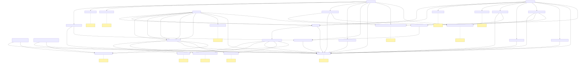

# civil-service

Civil CCD Callback Service.


### Contents:

- [StateFlow diagrams](#stateflow-diagrams)
- [Scheduled jobs](#scheduled-jobs)
- [Database schema diagram](#database-schema-diagram)
- [Building and deploying application](#building-and-deploying-the-application)
- [Pact or contract testing](#pact-or-contract-testing)
- [Adding Git Conventions](#adding-git-conventions)
- [Scheduler Framework](#scheduler-framework)

## StateFlow diagrams

Visual snapshots of the automated journey logic are generated from the live StateFlow configuration. The diagrams below update automatically via the `Refresh StateFlow diagrams` GitHub Action after any change to the transition builders.

#### Draft to Submission


#### Claim Issue & Notification


#### Awaiting Defence & Divergence


#### Post-Response Outcomes & Settlement


Each image links to an SVG whose source (`docs/*.mmd`) is produced by `python3 scripts/export_stateflow_transitions.py`. If you need the narrative in text form, see `docs/stateflow_transition_catalogue.md` or the structured `docs/stateflow/transition_catalogue.json`.

- Per-state allowed CCD events: [flowstate_allowed_events.md](docs/flowstate_allowed_events.md)
- Spec-only allowed CCD events: [flowstate_allowed_spec_events.md](docs/flowstate_allowed_spec_events.md)

#### Predicate Business Rules

Generated business rules from flowstate predicates in
- Composed & Atomic predicate rules: [business-rules.md](docs/business-rules.md)

## Email notification catalogue

Every Camunda notifier, the parties it contacts, the Gov.Notify templates it uses, and the BPMN/CCD entry points are tracked in [`docs/email-notifications.md`](docs/email-notifications.md). The table is generated automatically by `scripts/generate_email_notifications_table.py`, which walks the notifier/aggregator/generator hierarchy, reads template IDs from `src/main/resources/application.yaml`, and links the referencing BPMN files from `src/main/resources/camunda`.

The same data is published via GitHub Pages at https://hmcts.github.io/civil-service/email-notifications.html, so after commits land on `master` the interactive table is available to anyone with repo access.

<details>
<summary>How to regenerate `docs/email-notifications.md`</summary>

```bash
scripts/generate_email_notifications_table.py --bpmn-root src/main/resources
```

Need to focus on a single CCD event (or a handful)? Pass one or more `--ccd-event` filters to keep only rows whose
CCD event column contains the provided substring, e.g.

```bash
scripts/generate_email_notifications_table.py \
  --bpmn-root src/main/resources \
  --ccd-event DEFENDANT_RESPONSE_SPEC
```

Every run also emits `docs/email-notifications.html`, which mirrors the markdown but adds a CCD event dropdown so you can
filter interactively in a browser. Use `--html-output /path/to/file.html` to change the destination or `--html-output ""`
to skip generating it.

The `Verify email notification documentation` GitHub Action executes the same script on every push to `master` and fails if the committed markdown is out of date, so commits should always include any changes produced by the command above.

</details>

## Scheduled jobs

The project defines a set of timer-driven Camunda processes that keep cases moving without manual input. The table below lists each job, the external topic it drives, the cadence (Quartz cron expression, UTC), and the high-level responsibility.

<!-- SCHEDULED_JOBS_TABLE_START -->
| Job | Purpose | Camunda topic(s) | Schedule (cron, UTC) | When it runs |
| --- | --- | --- | --- | --- |
| Bundle creation scheduler | Builds bundles for eligible hearings each evening. | `BUNDLE_CREATION_CHECK` | `0 0 21 * * ?` | Daily at 21:00 |
| Decision outcome scheduler | Moves cases awaiting judicial decisions into the decision outcome workflow. | `MOVE_TO_DECISION_OUTCOME` | `0 40 0 * * ?` | Daily at 00:40 |
| Defendant response deadline check scheduler | Sweeps for defendants whose response deadline elapsed and triggers enforcement. | `DEFENDANT_RESPONSE_DEADLINE_CHECK` | `0 1 16 * * ?` | Daily at 16:01 |
| Evidence upload scheduler | Prompts parties to upload evidence when deadlines are approaching. | `EVIDENCE_UPLOAD_CHECK` | `0 30 17 * * ?` | Daily at 17:30 |
| Full admit pay immediately no payment scheduler | Escalates full-admit cases where an immediate payment was promised but not received. | `FULL_ADMIT_PAY_IMMEDIATELY_NO_PAYMENT_CHECK` | `0 0 0 * * ?` | Daily at 00:00 |
| GA doc upload notify scheduler | Sends notifications when GA supporting documents are uploaded. | `GADocUploadNotifyScheduler` | `0 0 23 * * ?` | Daily at 23:00 |
| GA order made scheduler | Publishes GA order-made events to downstream services each afternoon. | `GAOrderMadeScheduler` | `0 15 16 ? * * *` | Daily at 16:15 |
| GA response deadline processor | Processes GA response deadlines, judge revisits and respondent checks. | `GAResponseDeadlineProcessor`<br>`GAJudgeRevisitProcessor`<br>`GARespondentResponseCheckScheduler` | `0 15 17 * * ?` | Daily at 17:15 |
| GA unless order scheduler | Enforces GA Unless Orders once the compliance deadline passes. | `GAUnlessOrderScheduler` | `0 0 16 ? * * *` | Daily at 16:00 |
| Generate CSV and send to MMT scheduler | Produces nightly CSV/JSON exports for the mediation service (MMT). | `GenerateCsvAndSendToMmt`<br>`GenerateJsonAndSendToMmt` | `0 0 1 ? * * *` | Daily at 01:00 |
| Hearing cvp link scheduler | Issues CVP/remote hearing links on a daily cadence. | `HEARING_CVP_LINK` | `0 50 0 * * ?` | Daily at 00:50 |
| Hearing fee check scheduler | Checks for unpaid hearing fees and raises the necessary follow-up tasks. | `HEARING_FEE_CHECK` | `0 0 0 * * ?` | Daily at 00:00 |
| Incident retry scheduler | Retries failed external incident tasks each night. | `INCIDENT_RETRY_EVENT` | `0 1 23 * * ?` | Daily at 23:01 |
| Manage Stay WA Task Scheduler | Maintains WA tasks for stayed cases so that no follow-up is missed. | `MANAGE_STAY_WA_TASK_SCHEDULER` | `0 20 1 ? * * *` | Daily at 01:20 |
| Migrate cases scheduler | Reserved cron to re-run large case migration batches. | `MIGRATE_CASES_EVENTS` | `0 0 0 1 * ? 2080` | First day of each month until 2080 at 00:00 |
| Notify claim and claim dismissed deadline scheduler | Dismisses claims when the claim notification or claim dismissed deadline has passed. | `CLAIM_DISMISSED_DEADLINE` | `0 0 0 * * ?` | Daily at 00:00 |
| Notify claim details scheduler | Dismisses claims when the claim details notification deadline has passed. | `CLAIM_DETAILS_NOTIFICATION_DEADLINE` | `0 1 16 * * ?` | Daily at 16:01 |
| Order Review Obligation check scheduler | Checks order review obligations and triggers outstanding actions. | `ORDER_REVIEW_OBLIGATION_CHECK` | `0 10 1 * * ?` | Daily at 01:10 |
| Polling event emitter scheduler | Emits polling events across the day so downstream pollers stay in sync. | `POLLING_EVENT_EMITTER` | `0 0 8-20 * * ?` | Hourly at the top of the hour from 08:00–20:00 |
| Proof of debt scheduler | Generates proof-of-debt artefacts for COSC-linked general applications. | `CoscApplicationProcessor` | `0 0 16 * * ?` | Daily at 16:00 |
| Request for reconsideration notification check scheduler | Ensures reconsideration notifications are sent when conditions are met. | `REQUEST_FOR_RECONSIDERATION_NOTIFICATION_CHECK` | `0 10 0 * * ?` | Daily at 00:10 |
| Retrigger cases scheduler | One-off cron to retrigger case updates as part of the 2026 migration plan. | `RETRIGGER_CASES_EVENTS` | `0 0 0 1 * ? 2026` | First day of each month until 2026 at 00:00 |
| Settlement no response from defendant scheduler | Moves settlement agreements forward when the defendant failed to respond. | `SETTLEMENT_NO_RESPONSE_FROM_DEFENDANT_CHECK` | `0 0 1 * * ?` | Daily at 01:00 |
| Spec automated hearing notice scheduler | Builds automated hearing notices for Spec claims twice per day. | `AUTOMATED_HEARING_NOTICE` | `0 0 0,12 ? * * *` | Twice daily at 00:00 and 12:00 |
| Take case offline scheduler | Transitions cases that must move off digital rails. | `TAKE_CASE_OFFLINE` | `0 1 16 * * ?` | Daily at 16:01 |
| Trial ready check scheduler | Verifies trial readiness status for outstanding cases. | `TRIAL_READY_CHECK` | `0 30 0 * * ?` | Daily at 00:30 |
| Trial ready notification scheduler | Sends notifications when trial readiness has been confirmed. | `TRIAL_READY_NOTIFICATION_CHECK` | `0 20 0 * * ?` | Daily at 00:20 |
| Unspec automated hearing notice scheduler | Builds automated hearing notices for Unspec claims twice per day. | `AUTOMATED_HEARING_NOTICE` | `0 0 0,12 ? * * *` | Twice daily at 00:00 and 12:00 |
| Update General application Case management Location | Future-dated cron to re-sync GA case management locations. | `RETRIGGER_GA_UPDATE_CMLOCATION_EVENTS` | `0 0 0 1 * ? 2046` | First day of each month until 2046 at 00:00 |
| Update location | Future-dated cron to re-sync the main case location. | `RETRIGGER_UPDATE_LOCATION_EVENTS` | `0 0 0 1 * ? 2046` | First day of each month until 2046 at 00:00 |
<!-- SCHEDULED_JOBS_TABLE_END -->

Run `python3 bin/update-scheduled-jobs-table.py` whenever a BPMN scheduler is added or updated so the table stays in sync. The script reads every BPMN timer, merges in the human-readable descriptions held in `config/scheduled-jobs.json`, and rewrites the table between the markers above. If you add a new scheduler (or change the purpose of an existing one), update the JSON file first so the generated table has meaningful text. The `Verify scheduled jobs table` GitHub Action reruns this script on `master` and fails if `README.md` would change.

## Database schema diagram

The dashboard database schema diagram is generated by statically analysing the Flyway migrations and is available in [`docs/database.md`](docs/database.md). It focuses on the Civil dashboard tables in the `dbs` schema, marking primary keys, foreign keys, and nullable columns.

## Building and deploying the application

### Dependencies

The project is dependent on other Civil repositories:

- [civil-ccd-definition](https://github.com/hmcts/civil-ccd-definition)

Camunda BPMN definitions are included in this repository under `src/main/resources/camunda/`.

To set up complete local environment for Civil check [civil-sdk](https://github.com/hmcts/civil-sdk)

### Building the application

The project uses [Gradle](https://gradle.org) as a build tool. It already contains
`./gradlew` wrapper script, so there's no need to install gradle.

To build the project execute the following command:

```bash
  ./gradlew build
```

### Running the application

#### Environment variables

You will need the following environment variables setup in your bashrc/zshrc or IntelliJ run configuration. API keys can
be found in the Azure key store.

| Name | Use | Value |
| ---- | --- | ----- |
| `DOCMOSIS_TORNADO_KEY` | [Docmosis](https://www.docmosis.com/) is our document generation service. For development purposes we have been using trial keys which can be obtained [here](https://www.docmosis.com/products/tornado/try.html). **Note:** These expire after a month. | |
| `GOV_NOTIFY_API_KEY` | [GOV.UK Notify](https://www.notifications.service.gov.uk/) is our notification service for sending emails.  | |
| `LAUNCH_DARKLY_SDK_KEY` | [LaunchDarkly](https://launchdarkly.com/) is our platform for managing feature toggles. | |
| `LAUNCH_DARKLY_OFFLINE_MODE` | Sets LaunchDarkly to use local values for flags rather than connecting to the service | `true` |
| `SPRING_PROFILES_ACTIVE` | Sets the active Spring profile | `local` |


#### Create a Docker image

While not necessary for local development, you can create the image of the application by executing the following
command:

```bash
  ./gradlew assemble
```

Create docker image:

```bash
  docker-compose build
```

Run the distribution (created in `build/install/civil-service` directory) by executing the following command:

```bash
  docker-compose up
```

This will start the API container exposing the application's port (set to `4000` in this template app).

In order to test if the application is up, you can call its health endpoint:

```bash
  curl http://localhost:4000/health
```

You should get a response similar to this:

```
  {"status":"UP","diskSpace":{"status":"UP","total":249644974080,"free":137188298752,"threshold":10485760}}
```

### Preview environment

Preview environment will be created when opening new PR. CCD and Camunda BPMN definitions will be pulled from the latest
GitHub releases.

To access XUI visit url (make sure that it starts with `https`, otherwise IDAM won't let you log in):

- `https://xui-civil-service-pr-PR_NUMBER.service.core-compute-preview.internal`

To access Camunda visit url (login and password are both `admin`):

- `https://camunda-civil-service-pr-PR_NUMBER.service.core-compute-preview.internal`


### Functional test labels for targeted testing
There are a variety of labels that can be added to PRs for the purpose of running sub-groups of functional tests, relevant to specific journeys. All functional test labels begin with the pr_ft_ prefix.

Adding a functional test label allows the user to run a greater amount of tests relevant to the journey where changes are being made, and reduces the amount of time taken to run a build.

For example, if the label pr_ft_spec-part-admit is added to a PR, the PR will run only the API tests relevant to the Spec Part Admit journey.

It is also possible to add two labels to a PR to target multiple journeys. For example, if the labels pr_ft_spec-part-admit, and pr_ft_spec-part-admit are added to a PR, the PR will run only the API tests relevant to the Spec Part Admit, and Spec Full Admit journeys.

If no functional test label has been added to a PR, the full set of regression tests (api-nonprod) will be run.

For more details about the functional test labels available, the tests that run under each label, and the guidelines for using them, please refer to this confluence page: https://tools.hmcts.net/confluence/display/ROC/GitHub+Labels+for+Testing


## Contract testing

### Generate contracts

You can generate contracts as follows:

```
./gradlew contract
```

### Publish contracts

If you want to publish the contracts to hmcts pact broker, please set this env variable accordingly before running the
publish command.

```
export PACT_BROKER_FULL_URL=http://pact-broker.platform.hmcts.net/
```

If you want to publish the RPA contract to the PactFlow pact broker, please set this env variable accordingly before
running the publish command. By setting your env variable to this, the IDAM contract will be ignored and only the RPA
contract will be published to PactFlow.

```
export PACT_BROKER_FULL_URL=https://civil-claims.pactflow.io/
```

Before running, you should set the API token to connect to the pactflow portal as follows:

```bash
export PACT_BROKER_TOKEN=<api token here>
```

The API Token can be obtained on [Confluence](https://tools.hmcts.net/confluence/display/CU/Pactflow).

To publish your contracts:

```
./gradlew pactPublish
```

* If connecting to Pactflow, please disable the HMCTS VPN.

## Adding Git Conventions

### Include the git conventions.
 * Make sure your git version is at least 2.9 using the `git --version` command
 * Run the following command:
```
git config --local core.hooksPath .git-config/hooks
```
Once the above is done, you will be required to follow specific conventions for your commit messages and branch names.

If you violate a convention, the git error message will report clearly the convention you should follow and provide
additional information where necessary.

*Optional:*
* Install this plugin in Chrome: https://github.com/refined-github/refined-github

  It will automatically set the title for new PRs according to the first commit message, so you won't have to change it manually.

  Note that it will also alter other behaviours in GitHub. Hopefully these will also be improvements to you.

*In case of problems*

1. Get in touch with your Technical Lead so that they can get you unblocked
2. If the rare eventuality that the above is not possible, you can disable enforcement of conventions using the following command

   `git config --local --unset core.hooksPath`

   Still, you shouldn't be doing it so make sure you get in touch with a Technical Lead soon afterwards.

## Gradle Dependency Check - Running Locally
In the local environment, as of 15/12/2023 where dependency check is mandated to use version 9 or above:
https://github.com/jeremylong/DependencyCheck?tab=readme-ov-file#900-upgrade-notice

Users will now need to generate a NVD API key for themselves in order to run some gradle dependency commands:
https://nvd.nist.gov/developers/request-an-api-key

Example
```
./gradlew -DdependencyCheck.failBuild=true -Dnvd.api.check.validforhours=24 -Dnvd.api.key=<YOUR_API_KEY_HERE> dependencyCheckAggregate
```

If you're seeing errors when pulling images, run the following command:

If you're seeing errors after importing bpmn files then run it again.
XUI will be running on http://localhost:3000/

After creating a case in XUI, complete the payment using service request.
To update the payment success callback on a created case, please use [[civil-operation]](https://github.com/hmcts/civil-operations/)
http://rpe-service-auth-provider-aat.service.core-compute-aat.internal/testing-support/lease to generate token
then use http://localhost:4000/service-request-update-claim-issued endpoint with above token and then
update body with case id and payment reference no

## Development / Debugging Environment - Preview with Mirrord

  As an alternative for a development environment there is a procedure in place where after running the command
below the required services for Civil are created in Preview under the developer's name, so these will be exclusively
for the named developer use.

While connected to the VPN simply run one of the below commands from your project's (civil-service) folder:
Note: be sure to have Docker running
```shell
./bin/dev-setup/start-devuser-preview-environment.sh
```
You can optionally specify branches for CCD definitions and WA DMN definitions like below or leave them blank to use master.

```shell
./bin/dev-setup/start-devuser-preview-environment.sh ccdBranchName dmnBranchName
```
If you want to clean up the environment just run:

```shell
npx @hmcts/dev-env@latest --delete
```

Once the pods are up and running you can connect to them using a plugin called Mirrord on Intellij.
https://mirrord.dev

Most times, by just enabling the Mirrord plugin and running the application in debug mode a popup will come for you to select the target pod running civil-service.
In some setups you will need a mirrord config file specifying the pod as below.

The script should create a /.mirrord/.mirrord.json config file under the project's root directory.

Specifically for civil-service you might need to exclude a flyway environment variable to allow the startup process to run without errors.
For that you should have such file as this:

```json
{
  "feature": {
    "network": {
      "incoming": "steal",
      "outgoing": true
    },
    "fs": "read",
    "env": {
      "override": {
        "REFERENCE_DATABASE_MIGRATION": "false"
      }
    }
  },
  "target": {
    "path": {
      "pod": "Your civil-service pod ID"
    },
    "namespace": "civil"
  },
  "operator": false,
  "agent": {
    "flush_connections": false,
    "startup_timeout": 300,
    "namespace": "civil"
  }
}
```
## Point CCD definitions to a specific branch

Add the following label to your GitHub PR.

```
civilDefinitionBranch:????

where ???? is the branch name you want to point to. e.g civilDefinitionBranch:DTSCCI-1699

"disableWiremock" label to disable WireMock stubs and point API endpoints to real AAT instances.
By default, preview environments use WireMock for external services (fees-api, send-letter,
role-assignment, etc.). Add this label when you need to test against live AAT services.
```

## Scheduler Framework

The service includes a common framework for implementing scheduled tasks. This framework provides standard logging, error handling, and case processing logic.

### Core Components

- **`CivilScheduler`**: The main interface for scheduler components. Implementations should be annotated with `@Component` and `@Scheduled`.
- **`ScheduledTask`**: An interface extending `Consumer<CaseDetails>`, representing the logic to be executed for each case found.
- **`ScheduledTaskRunner`**: A component that coordinates the task execution, including case retrieval via a `Supplier<? extends TaskResult<T>>`.
- **`ElasticSearchService`**: A base class for services that search for cases to be processed by a scheduler.

### Creating a New Scheduler

1. **Implement a Search Service**: Extend `ElasticSearchService` to define the query for finding cases.
2. **Implement a Scheduled Task**: Implement `ScheduledTask` (or `Consumer<CaseDetails>`) to define what happens to each case.
3. **Create the Scheduler Class**:
    - Implement `CivilScheduler`.
    - Use `@Scheduled` on the `runScheduledTask` method.
    - Use `ScheduledTaskRunner.run()` to execute the task.
4. **Add Configuration**: Add settings to `application.yaml` for enabling the scheduler and defining its cron expression.

### Spring Scheduler Configuration

Spring-based schedulers are controlled by both a LaunchDarkly feature flag and an allowlist of active schedulers.

#### Feature Flag
The `spring-scheduler-enabled` flag in LaunchDarkly acts as a global kill-switch for all Spring-managed scheduled tasks. If this flag is disabled, no Spring schedulers will execute, regardless of their individual configuration.

#### Active Schedulers List
To enable specific Spring schedulers, they must be added to the `active-schedulers` list in `application.yaml` or via the `SCHEDULER_ACTIVE_SCHEDULERS` environment variable.

**Configuration in `application.yaml`:**
```yaml
scheduler:
  active-schedulers: ${SCHEDULER_ACTIVE_SCHEDULERS:JudgementBuffer,DefendantResponseDeadline}
```

**Using Environment Variables:**
To enable multiple schedulers, provide a comma-separated list:
```bash
export SCHEDULER_ACTIVE_SCHEDULERS="JudgementBuffer,DefendantResponseDeadline"
```

To disable all Spring schedulers (even if the feature flag is on), set the list to be empty:
```bash
export SCHEDULER_ACTIVE_SCHEDULERS=""
```

### JudgementBufferScheduler

The `JudgementBufferScheduler` is used to process cases where a default judgement has been requested and a buffer period has expired.

#### Settings

Settings for this scheduler can be found in `src/main/resources/application.yaml` under `scheduler.judgement-buffer`.

| Setting | Description | Default | Environment Variable |
|---------|-------------|---------|----------------------|
| `enabled` | Whether the scheduler is active. | `false` | `SCHEDULER_ENABLED_JUDGEMENT_BUFFER` |
| `cronExpression` | When the scheduler runs. | `0 0 2 * * *` (Daily at 2 AM) | `CRON_EXPRESSION_JUDGEMENT_BUFFER` |

#### Global Scheduler Settings

| Setting | Description | Default | Environment Variable |
|---------|-------------|---------|----------------------|
| `lockAtLeastFor` | Minimum time a task lock is held. | `PT1M` | `LOCK_AT_LEAST_FOR` |
| `lockAtMostFor` | Maximum time a task lock is held. | `PT5M` | `LOCK_AT_MOST_FOR` |

## License

This project is licensed under the MIT License - see the [LICENSE](LICENSE) file for details
