# Database schema

The dashboard database diagram is generated by statically analysing the Flyway migrations in `src/main/resources/db/migration`.

The committed source for the diagram is [`database_diagram.mmd`](database_diagram.mmd). Regeneration is handled by the `Refresh database diagram` GitHub Action on `master` when Flyway migration files change.
